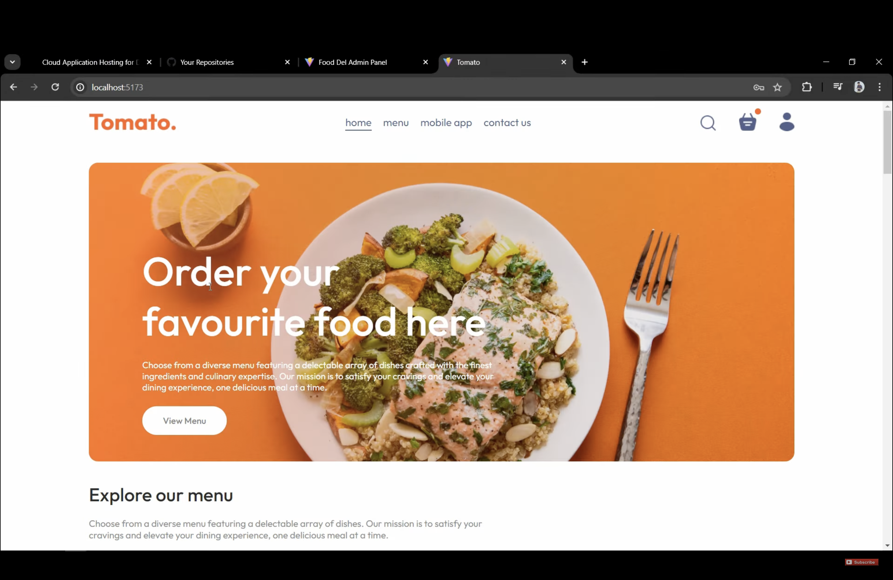
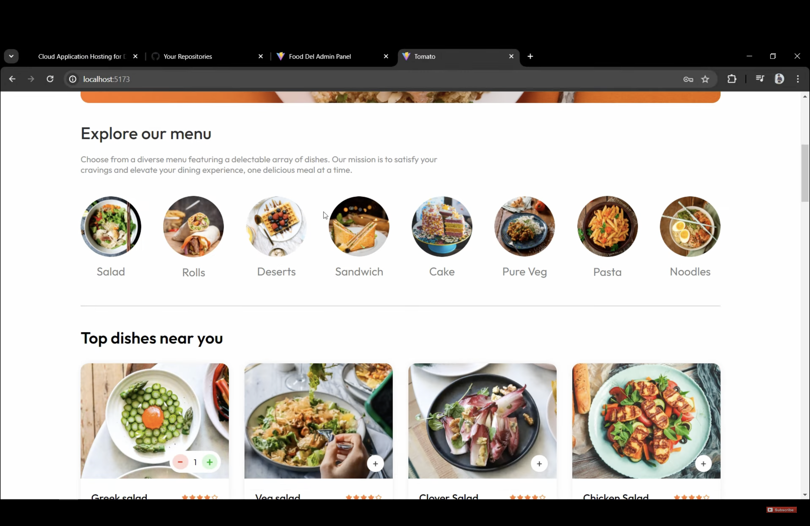
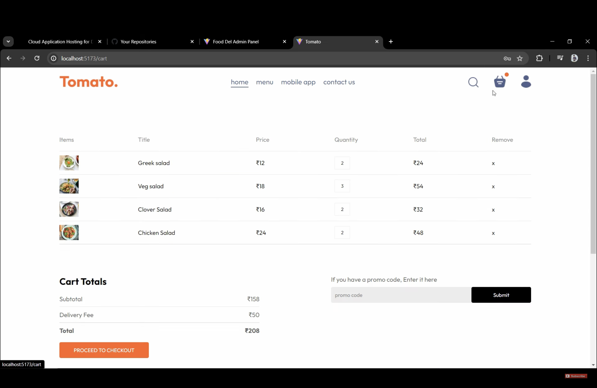
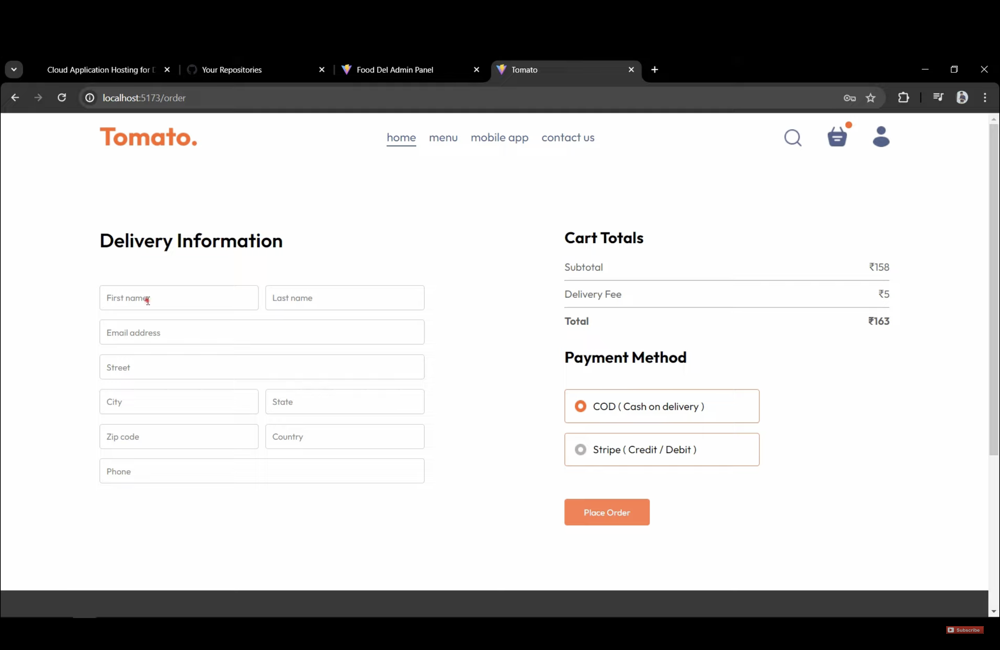
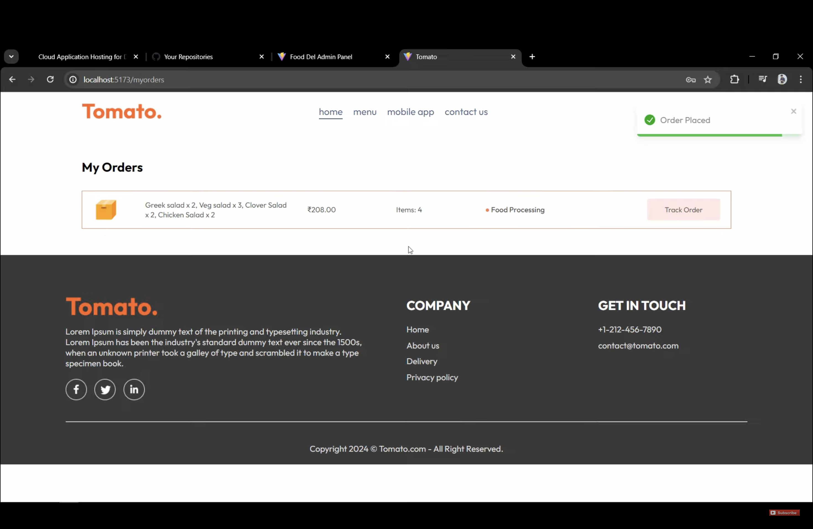
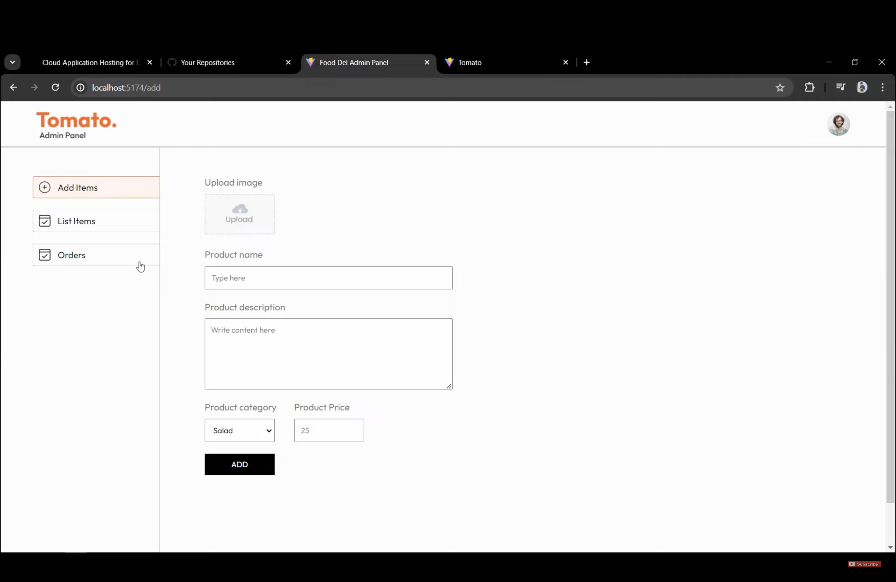
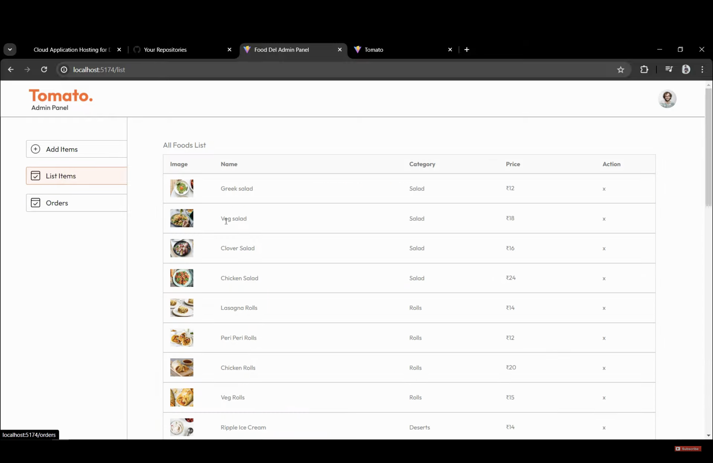
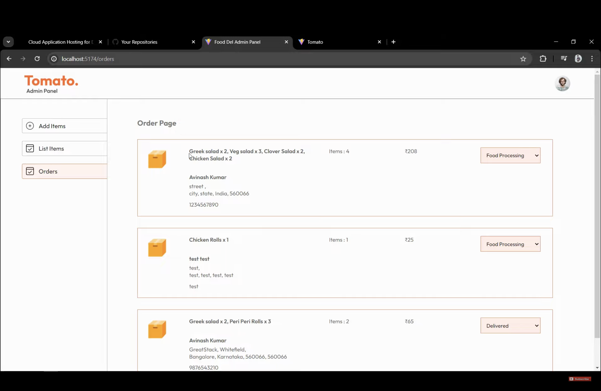

# Full-Stack Food Delivery Web App using MERN

A modern and responsive full-stack food delivery application built using **React JS**, **Node.js**, **Express**, **MongoDB**, and **Stripe** for secure payment integration. It features a user-friendly interface, dynamic cart management, and an admin panel for managing orders and products.
This README includes **setup** and **deployment** instructions to help you get the project running locally and deploy it online.


---

## Deployment Links :

### User Frontend
The user-facing frontend can be accessed here:
[User Frontend - Live Deployment](https://mern-tomato-full-stack-food-delivery-0k15.onrender.com)

### Admin Frontend
The admin panel can be accessed here:
[Admin Frontend - Live Deployment](https://mern-tomato-full-stack-food-delivery-5bj4.onrender.com)


---


## 🚀 Features

### **Frontend**:
- Browse food categories.
- Add items to the cart and proceed to checkout.
- Online and cash-on-delivery payment options.
- Dynamic cart management for adding, viewing, and modifying items.
- Responsive design ensuring compatibility with all devices (mobile-first layout).
- Routing handled using **React Router Dom** for smooth navigation.

### **Admin Panel**:
- Add, list, and manage food items through an intuitive interface.
- Monitor and update order statuses.
- View and manage user information efficiently.

### **Backend**:
- Node.js-based server with Express for API handling.
- MongoDB as the database for storing user, product, and order data.
- Secure API communication for frontend and admin panel integration.

### **Other Features**:
- **User Authentication**: Secure login and registration using **JWT (JSON Web Tokens)**.
- **Stripe Integration**: Secure and reliable payment gateway for online transactions.
- **State Management**: Efficient state handling using the **Context API**.
- **Responsive Design**: Ensures seamless experience across all devices.


---

## 📂 Folder Structure

### Root Directory

```
.
├── admin                 # Admin Panel Frontend
│   ├── README.md
│   ├── index.html
│   ├── package.json
│   ├── public/           # Public assets
│   ├── src/              # Source code
│   │   ├── assets/       # Images and assets
│   │   ├── components/   # Navbar, Sidebar, etc.
│   │   ├── pages/        # Add, List, Orders pages
│   │   ├── App.jsx
│   │   ├── index.css
│   │   └── main.jsx
│   └── vite.config.js    # Configuration
├── backend               # Backend (Node.js & Express)
│   ├── config/           # Database configuration
│   ├── controllers/      # API Controllers
│   ├── middleware/       # Auth Middleware
│   ├── models/           # Mongoose Models
│   ├── routes/           # API Routes
│   ├── server.js         # Main server file
│   └── uploads/          # File uploads (images, etc.)
└── frontend              # User-Facing Frontend
    ├── README.md
    ├── index.html
    ├── package.json
    ├── public/           # Public assets
    ├── src/              # Source code
    │   ├── assets/       # Images and assets
    │   ├── Context/      # Context API for state management
    │   ├── components/   # Shared components (Navbar, Footer, etc.)
    │   ├── pages/        # Pages (Cart, Home, PlaceOrder, etc.)
    │   ├── App.jsx
    │   ├── index.css
    │   └── main.jsx
    └── vite.config.js    # Configuration
```

---

## 🛠️ Setup Instructions

### Prerequisites
- Install **Node.js**: [Download Node.js](https://nodejs.org/en/download/)
- Setup **MongoDB**: Use MongoDB Atlas [Guide](https://www.mongodb.com/cloud/atlas/register)
- Obtain a **Stripe API Key**: Sign up at [Stripe](https://stripe.com/)

---

### Backend Setup

1. Navigate to the `backend` directory in your terminal:
   ```bash
   cd backend
   ```
2. Install dependencies:
   ```bash
   npm install
   ```
3. Configure environment variables:
   - Create a `.env` file in the `backend` directory with the following keys:
     ```env
     PORT=5000
     MONGO_URI=<Your MongoDB Connection String>
     STRIPE_SECRET_KEY=<Your Stripe Secret Key>
     JWT_SECRET=<Your JWT Secret>
     ```
4. Start the backend server:
   ```bash
   npm run server
   ```
5. Verify by visiting [http://localhost:4000](http://localhost:4000). You should see `API is working`.

---

### Frontend Setup (User)

1. Navigate to the `frontend` directory:
   ```bash
   cd frontend
   ```
2. Install dependencies:
   ```bash
   npm install
   ```
3. Start the frontend:
   ```bash
   npm run dev
   ```
4. Open the app in your browser at [http://localhost:5173](http://localhost:5173).

---

### Admin Panel Setup

1. Navigate to the `admin` directory:
   ```bash
   cd admin
   ```
2. Install dependencies:
   ```bash
   npm install
   ```
3. Start the admin panel:
   ```bash
   npm run dev
   ```
4. Access the admin panel in your browser at [http://localhost:5174](http://localhost:5174).

---

### Stripe Integration
1. Obtain your Stripe secret key from the Stripe dashboard.
2. Add the secret key in `.env` in the `backend` folder:
   ```
   STRIPE_SECRET_KEY=<your-secret-key>
   ```
3. Update currency code in `controllers/orderController.js` to match your local currency.

---

## 🌐 Deployment Instructions

### Backend Deployment
1. **Upload Backend to GitHub**:
   - Commit and push the backend folder to GitHub.

2. **Deploy Backend on Render**:
   - Visit [Render](https://render.com).
   - Create a new web service and connect your GitHub repository.
   - Set the root directory to `backend`.
   - Add environment variables from the `.env` file.
   - Deploy the service and copy the backend URL.

3. **Update Frontend and Admin URLs**:
   - Replace all occurrences of the local backend URL (e.g., `http://localhost:4000`) with the deployed backend URL in:
     - `frontend/src/Context/StoreContext.jsx`
     - `admin/src/assets/properties.js`

---

### Frontend Deployment
1. **Upload Frontend to GitHub**:
   - Commit and push the frontend folder to GitHub.

2. **Deploy Frontend on Render**:
   - Create a new static site on Render.
   - Connect your GitHub repository.
   - Set the root directory to `frontend`.
   - Add build commands:
     ```bash
     npm install
     npm run build
     ```
   - Set the publish directory to `dist`.
   - Deploy the site and copy the frontend URL.

3. **Add Rewrite Rules**:
   - Go to the static site settings and add:
     ```
     Source: /*
     Destination: /index.html
     ```

---

### Admin Panel Deployment
1. **Upload Admin to GitHub**:
   - Commit and push the admin folder to GitHub.

2. **Deploy Admin Panel on Render**:
   - Create a new static site on Render.
   - Connect your GitHub repository.
   - Set the root directory to `admin`.
   - Add build commands:
     ```bash
     npm install
     npm run build
     ```
   - Set the publish directory to `dist`.
   - Deploy the site and copy the admin URL.

3. **Add Rewrite Rules**:
   - Go to the static site settings and add:
     ```
     Source: /*
     Destination: /index.html
     ```


---

## 📸 Screenshots

### 1. Home Page


### 2. Menu Page


### 3. Top Dishes Section


### 4. Cart Page


### 5. Checkout Page


### 6. Order Placed Confirmation


### 7. Admin Panel - Add Item


### 8. Admin Panel - List Items


### 9. Admin Panel - Orders Management


---

## 📄 License

This project is licensed under the [MIT License](LICENSE).

---

